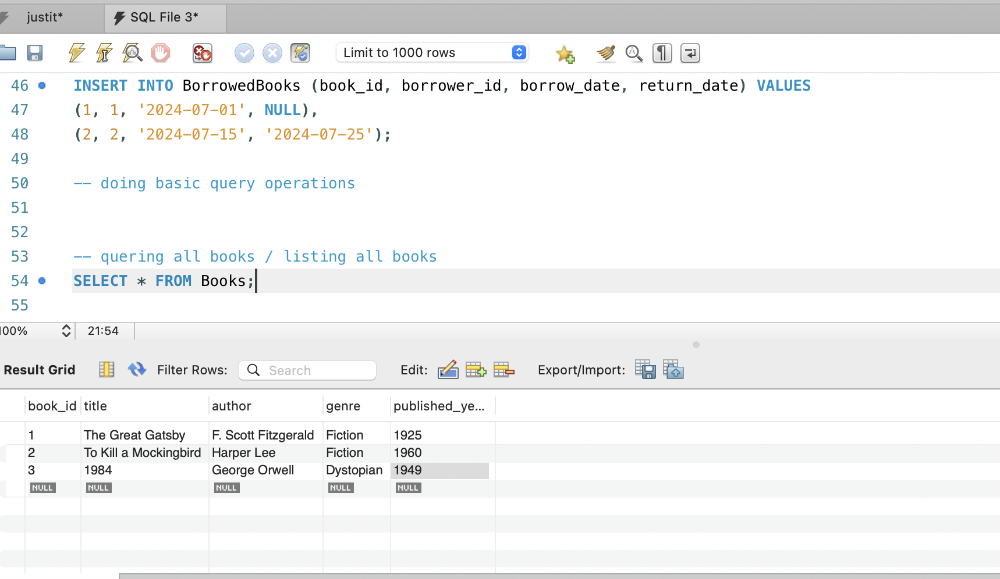
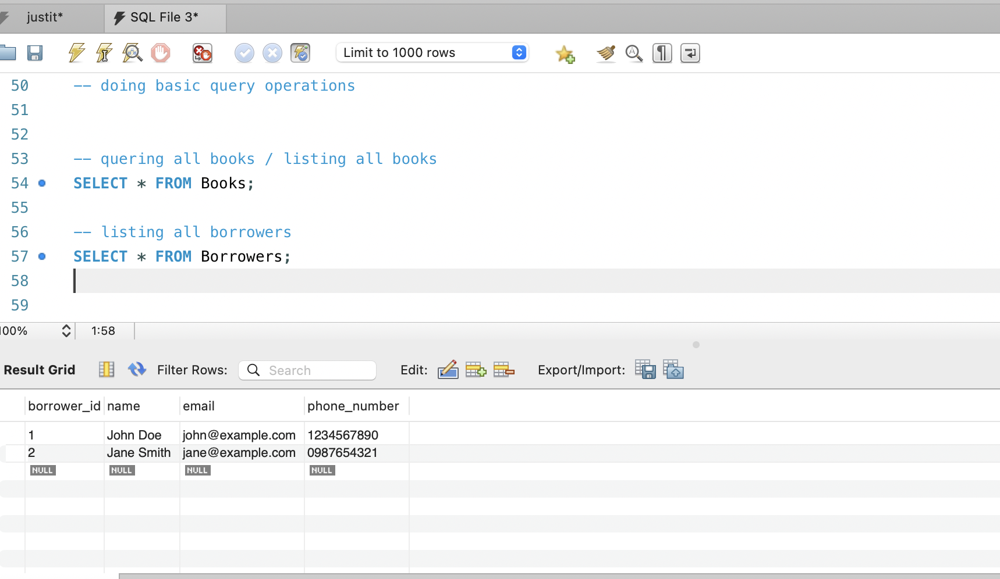
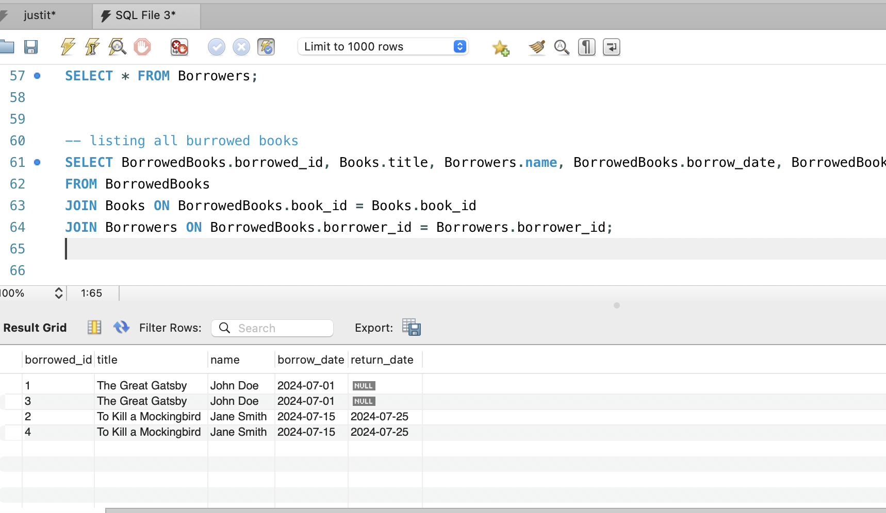
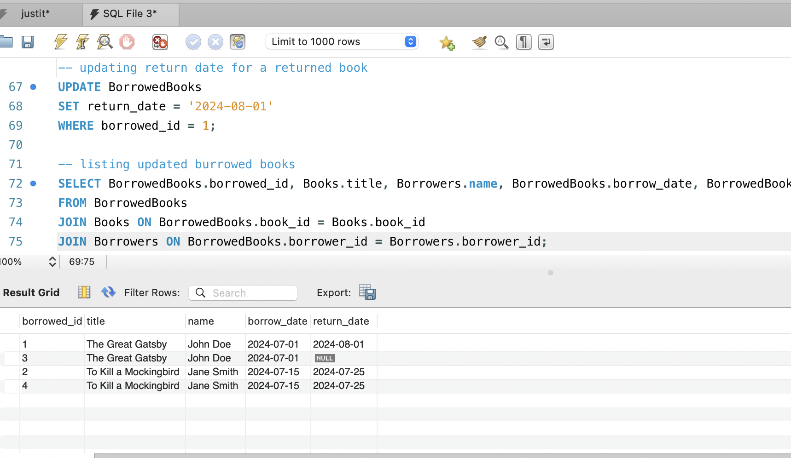
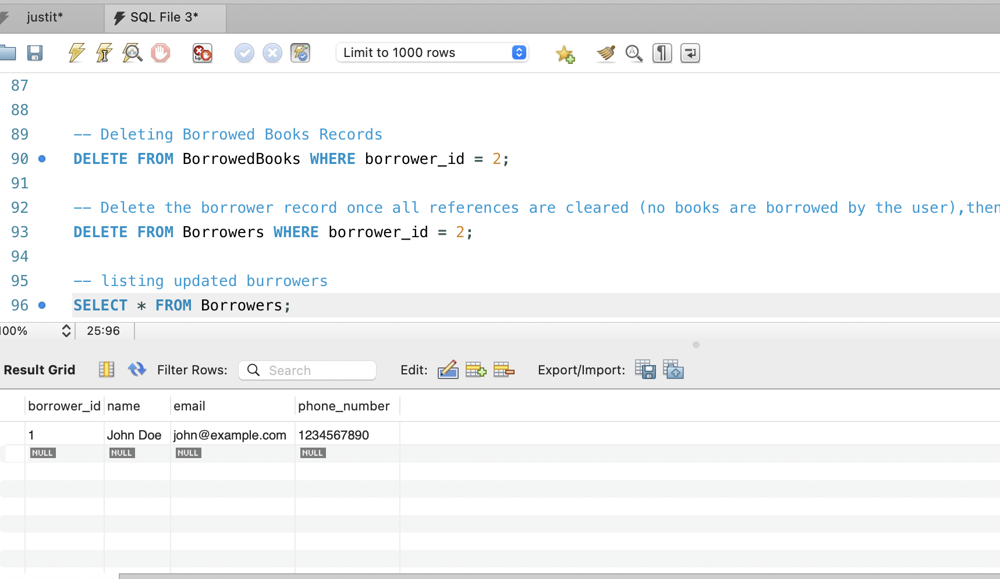

# LibraryManagementSystemDB
A simple library management system database using MySQL and MySQL Workbench app that allows CRUD operations.

### Database Structure

- Database Name: LibraryDB

- tables: 
 
 1. Books - contains book_id(primary key), title, author, genre, published_year
 2. Borrowers: contaibs borrowers_id(primary key), name, email, phone_number
 3. BurrowedBooks: borrowed_id(primary key), 2 primary keys of prrevious table as foreign key (book_id and borrowers_id), borrow_date, return_date

### Relationship between tables

1. Books and BorrowedBooks
 Type of Relationship: One-to-Many
 Primary Key: Books.book_id
 Foreign Key: BorrowedBooks.book_id
 Description: A single book can be borrowed multiple times by different borrowers over time. The Books table is related to the BorrowedBooks table via the book_id field. The book_id in the Books table is a primary key, and in the BorrowedBooks table, it is a foreign key. This relationship ensures that each entry in the BorrowedBooks table corresponds to a valid book in the Books table.
 
2. Borrowers and BorrowedBooks
 Type of Relationship: One-to-Many
 Primary Key: Borrowers.borrower_id
 Foreign Key: BorrowedBooks.borrower_id
 Description: A single borrower can borrow multiple books over time. The Borrowers table is related to the BorrowedBooks table via the borrower_id field. The borrower_id in the Borrowers table is a primary key, and in the BorrowedBooks table, it is a foreign key. This relationship ensures that each entry in the BorrowedBooks table corresponds to a valid borrower in the Borrowers table.

### Queries performed

1. Create DataBase and Creating a table example using Create database and Create table:

```
-- creating database 
CREATE DATABASE LibraryDB;

-- using newly created database 
USE LibraryDB;

--  creating books table that will hold attributes for books 
CREATE TABLE Books (
    book_id INT AUTO_INCREMENT PRIMARY KEY,
    title VARCHAR(255) NOT NULL,
    author VARCHAR(255) NOT NULL,
    genre VARCHAR(100),
    published_year INT
);

```
2. Adding data to a table using Insert INTO Table name ():

```
-- inserting sample data for books

INSERT INTO Books (title, author, genre, published_year) VALUES
('The Great Gatsby', 'F. Scott Fitzgerald', 'Fiction', 1925),
('To Kill a Mockingbird', 'Harper Lee', 'Fiction', 1960),
('1984', 'George Orwell', 'Dystopian', 1949);

```

3. Listing all books using Select * From TableName:

```
-- quering all books / listing all books
SELECT * FROM Books;

```
4. Updating burrowed books using UPDATE:

```
-- updating return date for a returned book

UPDATE BorrowedBooks
SET return_date = '2024-08-01'
WHERE borrowed_id = 1;

```
5. Deleting burrowers list using DELETE:

```
-- Delete the borrower record once all references are cleared (no books are borrowed by the user),then delete the borrower

DELETE FROM Borrowers WHERE borrower_id = 2;

```

### CRUD operations Screenshots:

1. Create and Read all Books, Burrowers and BurrowedBooks from table:







2. Update for burrowed books after updating return_date:



3. Delete borrower list from borrowers table:



